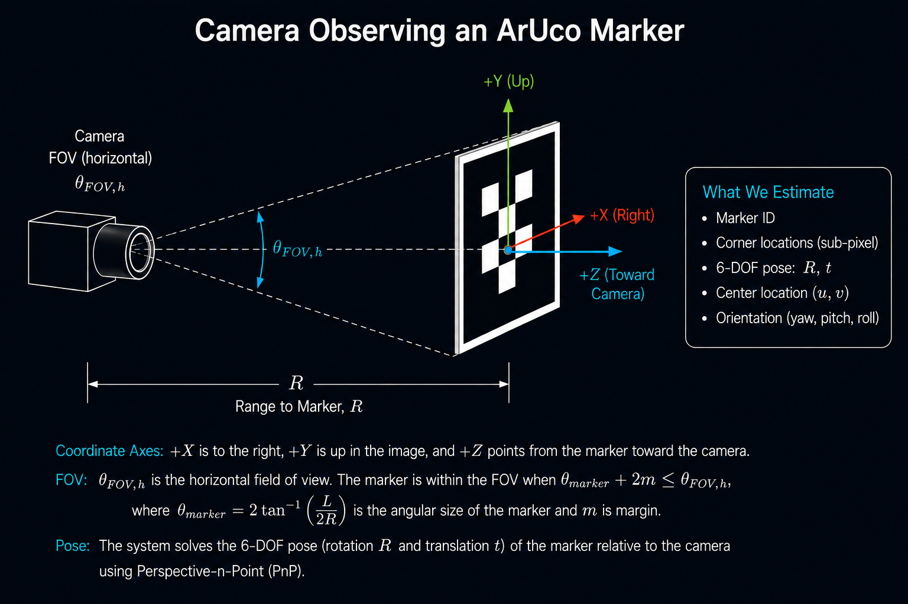

# ArUco Fiducial Detection

## Summary

The ArUco Fiducial Detection stage converts the camera image into a structured geometric measurement that downstream pointing and stabilization logic can use. In this system, the ArUco marker serves as a cooperative visual reference target: once the camera observes the marker, the software can estimate marker identity, image-plane position, corner locations, and relative pose instead of relying on ambiguous brightness blobs or appearance-only tracking.

An ArUco marker is a square, high-contrast fiducial pattern with a known binary code and known geometry. The detector searches the image for candidate square regions, decodes the marker identity, refines the detected corner locations, and uses the known marker geometry with camera calibration to estimate pose. This makes ArUco useful for cooperative tracking in well-lit environments where the target can be designed, printed, mounted, and illuminated in a controlled way.

## How It Works

The ArUco detector receives camera frames after the Main Steering Mirror has placed the expected target within the field of view. The detection pipeline identifies square marker candidates, rejects invalid patterns, decodes the marker ID, refines the corner locations, and produces a geometric measurement. The most useful outputs for this tracking architecture are the marker center in image coordinates, the detected corner positions, and the relative pose of the marker with respect to the camera.

This stage is also where optical design and computer vision meet. A wider camera field of view improves the chance of acquiring the marker after coarse pointing uncertainty, but it also spreads the same sensor pixels over a larger angular region. That reduces the number of pixels across a marker of fixed physical size and range, which can make detection, corner refinement, and pose estimation less reliable. A narrower field of view improves pixel density and angular precision, but it demands better upstream pointing to keep the marker in frame.

## Field of View and Marker Size

For a square marker with physical side length \(L\) observed at range \(R\), the approximate angular size of the marker is:

\[
\theta_{marker} = 2 \tan^{-1}\left(\frac{L}{2R}\right)
\]

For small angles, this is approximately:

\[
\theta_{marker} \approx \frac{L}{R}
\]

If the horizontal field of view is \(\theta_{FOV,h}\), the marker must fit within the camera field of view with enough margin for pointing uncertainty, motion, and detection robustness:

\[
\theta_{FOV,h} \geq \theta_{marker} + 2m
\]

where \(m\) is an angular margin on each side. This relationship captures the acquisition trade: a wider FOV makes it easier to get the marker into the image, while a narrower FOV gives more pixels per degree once the marker is visible.

A useful pixel-coverage estimate is:

\[
N \approx \frac{f_{px} L}{R}
\]

where \(N\) is the marker width in pixels and \(f_{px}\) is the camera focal length expressed in pixels. In practice, reliable detection needs enough marker pixels to resolve the black and white cell pattern, reject false candidates, and localize the four corners. Very small markers may still be visible but may not be reliable enough for closed-loop control.

## Angular Accuracy from Sub-Pixel Centering

OpenCV’s ArUco pipeline can refine marker corners to sub-pixel precision before pose estimation or image-plane measurement. The practical angular limit from image-space centering can be estimated from the pinhole camera model. If the marker center uncertainty is \(\sigma_{pix}\) pixels and the focal length is \(f_{px}\) pixels, then the approximate one-sigma angular uncertainty is:

\[
\sigma_{\theta} \approx \frac{\sigma_{pix}}{f_{px}}
\]

At range \(R\), the corresponding transverse pointing uncertainty is approximately:

\[
\sigma_{point} \approx R \sigma_{\theta}
\]

or:

\[
\sigma_{point} \approx R \frac{\sigma_{pix}}{f_{px}}
\]

This is a best-case image-measurement relationship, not a full system pointing error budget. Real performance also depends on illumination, focus, lens distortion calibration, motion blur, marker print quality, exposure time, rolling-shutter effects, corner refinement settings, and filtering latency.

## Processing Load

ArUco detection is computationally efficient compared with many general-purpose feature-tracking or neural-network perception methods, but it is not free. The detector must threshold or segment the image, search for contours or square candidates, validate candidate geometry, decode marker IDs, optionally refine corners, and solve pose using camera intrinsics. Processing cost scales with image resolution, the number of candidate regions, dictionary size, and the amount of refinement performed.

For a real-time optical tracking system, this cost matters because perception latency directly affects the control loop. Higher resolution may improve marker pixel coverage and pose quality, but it also increases frame-processing time. A practical implementation should measure detection latency on the target processor and select image resolution, region of interest, dictionary size, and refinement settings as part of the control-system design rather than treating vision performance as independent from stabilization performance.

## Key Takeaways

- ArUco detection converts camera imagery into a structured geometric measurement.
- The marker provides identity, corner locations, image-plane center, and relative pose information.
- Field of view, marker size, range, and pixel coverage are tightly coupled.
- Wider FOV improves acquisition probability but reduces pixel density on the marker.
- Sub-pixel corner and center refinement can improve angular accuracy, but only within the limits of optics, calibration, exposure, and processing latency.
- Processor load must be managed because detection latency becomes part of the closed-loop tracking problem.

## References

- [OpenCV ArUco marker detection documentation](https://docs.opencv.org/4.x/d5/dae/tutorial_aruco_detection.html)
- [OpenCV ArUco detector parameters and corner refinement](https://docs.opencv.org/4.x/d1/dcd/structcv_1_1aruco_1_1DetectorParameters.html)
- [Garrido-Jurado et al., “Automatic generation and detection of highly reliable fiducial markers under occlusion,” Pattern Recognition, 2014](https://doi.org/10.1016/j.patcog.2014.01.005)
- [Pinhole camera model notes, University of Amsterdam](https://staff.fnwi.uva.nl/r.vandenboomgaard/IPCV20162017/LectureNotes/CV/PinholeCamera/PinholeCamera.html)

## Back to System Summary

  

    <a href="camera-observation.md">
      ← Camera Observation
    </a>
  

  

    <a href="image-plane-tracking-error.md">
      Continue to Image Plane Tracking Error →
    </a>
  

