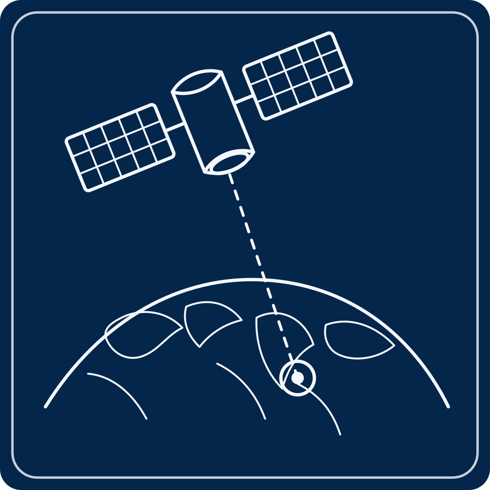
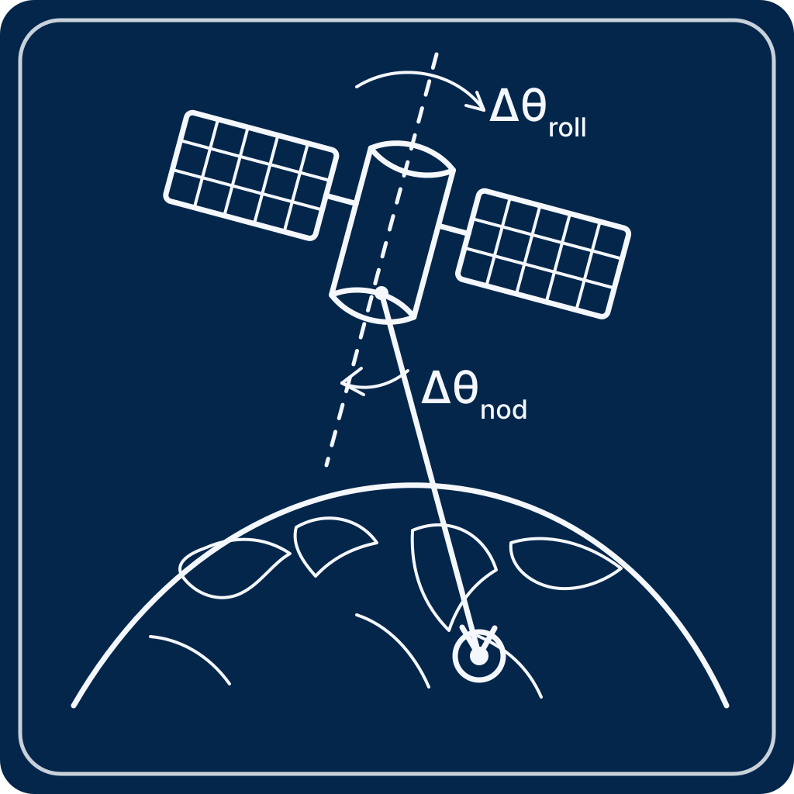

# Dual-Mirror Optical Tracking & Reference Stabilization

## Summary

A dual-stage optical tracking architecture for precision stabilization of a cooperative visual reference target.

The system combined:

- **Coarse optical steering** using a main steering mirror to maintain line-of-sight alignment to an estimated ground track
- **Fine optical stabilization** using a fast steering mirror (FSM) for high-bandwidth correction
- **Vision-based reference tracking** using a large ArUco fiducial as a geometric visual reference
- **Predictive control concepts** to improve tracking performance under latency and disturbances

The project explored how **perception, controls, estimation, and real-time software** interact in a precision optical system operating under imperfect knowledge and real-world constraints.

### Tracking Concept

The system performed closed-loop stabilization using a dual-mirror optical architecture.

Estimated Ground Track

→

Coarse Pointing Estimate

→

🪞

Main Steering Mirror

→

📷

Camera Observation

→

⬛

ArUco Fiducial Detection

→

⊕

Image-Plane Tracking Error

→

⚡

Fast Steering Mirror (FSM)

→

✨

Fine Optical Stabilization

---

## Problem Context

### Objective

Maintain precision alignment to a cooperative ground reference target despite:

- imperfect coarse pointing knowledge
- changing line-of-sight geometry
- vibration and disturbances
- camera latency
- limited field of view
- actuator bandwidth limitations

The system architecture separated large-angle pointing from high-bandwidth stabilization to improve robustness and tracking precision.

### Why It Was Hard

A single optical steering stage created competing requirements:

| Requirement | Design Pressure |
|---|---|
| Large pointing corrections | favors slower, large-range actuation |
| Fine stabilization | favors small, high-bandwidth actuation |
| Camera latency | reduces achievable control bandwidth |
| Disturbances and jitter | benefit from predictive compensation |
| Narrow field of view | increases acquisition sensitivity |

The result was a **coarse/fine dual-mirror architecture**, where each mirror solved a different part of the control problem.

---

## System Architecture

## Major System Elements

### Coarse Steering Layer

The main steering mirror maintained approximate line-of-sight alignment using estimated target geometry and lower-bandwidth corrections.

> **Focus:** acquisition, large-angle motion, target visibility, and reducing FSM authority demands.

### Fine Stabilization Layer

The fast steering mirror corrected residual image-plane tracking error.

> **Focus:** high-bandwidth stabilization, disturbance rejection, fine pointing correction, and maintaining precise target alignment.